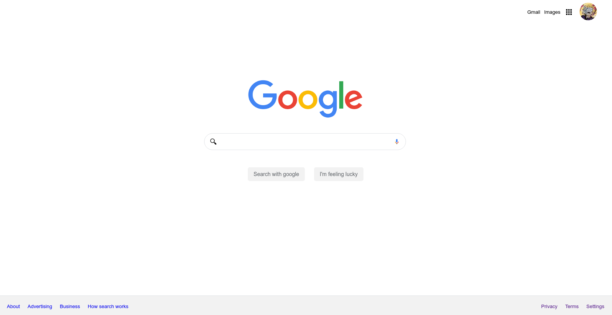

# HTML Practice Course

[Take the course!](https://platzi.com/cursos/html-practico)

> Is on spanish 🃏

> [Live Demo](https://ultirequiem.github.io/practice-html-platzi)

## Support

Open an Issue, I will check it a soon as possible 👀

If you want to hurry me up a bit
[send me a tweet](https://twitter.com/UltiRequiem) 😆

Consider [supporting me on Patreon](https://patreon.com/UltiRequiem) if you like
my work 🚀

Don't forget to start the repo ⭐

## Authors

[Eliaz Bobadilla (a.k.a UltiRequiem)](https://ultirequiem.com) - Creator and
Maintainer 💪

See also the full list of
[contributors](https://github.com/UltiRequiem/practice-html-platzi/contributors)
who participated in this project.

## Licence

Licensed under the MIT License.
